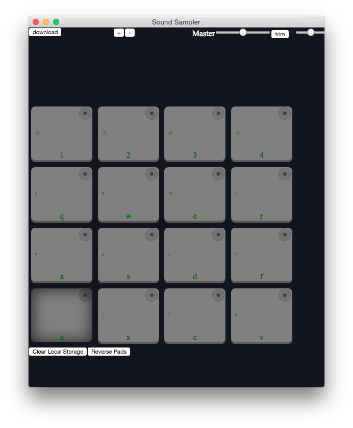
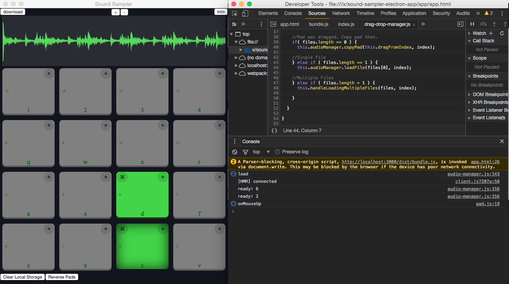

## Initial Thoughts

I have been working with Jekyll over the past few weeks. So I didn't notice that my electron dev skills were getting a bit rusty. I discovered this when I dusted off my electron sound editing app when I discovered that nothing worked when I went to npm serve.



Then the next thing I notice was that I was unable to launch the dev tools inspector with the normal chrome way:
```
alt+command+i
```
I'm thinking that I may have disabled dev tools when I was packaging the final product. I can see a need for a separation between dev and public that I could make in the future.

I also noticed that I had some changes on a branch that had not been added as a commit. So I did git commit for those items. Then switched to the master branch and still nothing works.

It's always frustrating to resurrect an old projects and realize it doesn't work out of the box. But that is to be expected in development. Although nothing works now I am confident I will be able to continue with ease based on how well I organized all the modules of the project. Will see if my tune changes later on.

Luckily I am a proponent of Read Me docs. And I found the command I was supposed to run to see dev tools. The following command launches the electron app with dev tools.
```
npm run dev
```
I can't remember clearly, but I think I had to install an npm package to get this to work.



As you can see from the screen shot above. The app is working fine. It would seem that it remembered the two sound files I was using last time. Thanks to the localstorage manager module that I wrote:

```javascript

import LZString from 'lz-string';

import dataURItoBlob from '../modules/dataURItoBlob';
import readAsDataURL from '../modules/readAsDataURL';


class StorageManager {
  constructor(){
    this.audioBlobs = new Array(
      null,null,null,null,null,null,null,null,null,null,null,null,null,null,null,null
    );
    //Insert local storage blobs
    this.audioBlobs = this.audioBlobs.map(function(audioObject, index){
      if( localStorage.getItem('dataurl_'+index) === null  ){
        return null
      } else {

        return dataURItoBlob( LZString.decompress( localStorage.getItem('dataurl_'+index) ) );
      }
    }.bind(this));

    //Set Region starts
    if( localStorage.getItem('audioStart') === null ){
      this.audioStart = new Array(
        0,0,0,0,0,0,0,0,0,0,0,0,0,0,0,0
      );
    } else {
      this.audioStart = JSON.parse(localStorage.getItem('audioStart'));
    }

    //Set Region Ends
    if( localStorage.getItem('audioEnd') === null ){
      this.audioEnd = new Array(
        null,null,null,null,null,null,null,null,null,null,null,null,null,null,null,null
      );
    } else {
      this.audioEnd = JSON.parse(localStorage.getItem('audioEnd'));
    }
    this.names = new Array('name','name','name','name','name','name','name','name','name','name','name','name','name','name','name','name');

  }

  clearAll(){
    localStorage.clear();
  }

  clear(index){
    //Clear start
    this.setAudioStart(index, 0);
    // Clear End
    this.setAudioEnd(index, null);
    //Clears object
    this.audioBlobs[index] = null;
    // Update local storeage
    localStorage.removeItem('dataurl_'+index);
  }

  store(index,blob){
    //Store Blob in memory
     this.audioBlobs[index] = blob;
    //Store Blob in local storage
    // If blob is null that means that a blank pad is being copied into an existing one. Lets delete the item.
    if(blob == null){
      localStorage.removeItem('dataurl_'+index)
    // Otherwise load the blob into local storage if it exists.
    } else {
      readAsDataURL(blob)
      .then(function(dataurl){
        //Compress then store data url
        localStorage.setItem('dataurl_'+index, LZString.compress(dataurl));
      });
    }
  }

  getAudioBlobs(){
    return this.audioBlobs;
  }

  getAudioBlob(index){
    return this.audioBlobs[index];
  }

  getAudioStart(index){
    return this.audioStart[index];
  }

  getAudioEnd(index){
    return this.audioEnd[index];
  }

  getNames(){
    return this.names;
  }

  setAudioStart(index, value){
    this.audioStart[index] = value;
    this.storeRegions();
  }

  setAudioEnd(index, value){
    this.audioEnd[index] = value;
    this.storeRegions();
  }

  storeRegions(){
    localStorage.setItem('audioStart', JSON.stringify(this.audioStart));
    localStorage.setItem('audioEnd', JSON.stringify(this.audioEnd));
  }
}

module.exports = StorageManager

```

The storage manager is a pretty opinionated piece of code. But its function is to back up state to local storage including the audio blobs that are passed in from dragging and dropping. The only limitation is being able to store longer audio samples. I think there is a character max. I will write about this at some point.

## Packaging

I thought I would give it a go and package the app so I can include it in my portfolio:
```
npm run package
```

Looks like everything worked well. I was able to create a mac package.


# [DOWNLOAD IT HERE](../sound-sampler-app-download/)


<!--  ----- -->
